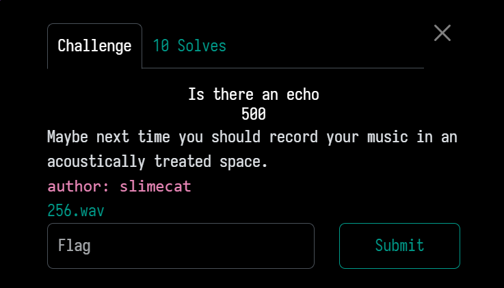
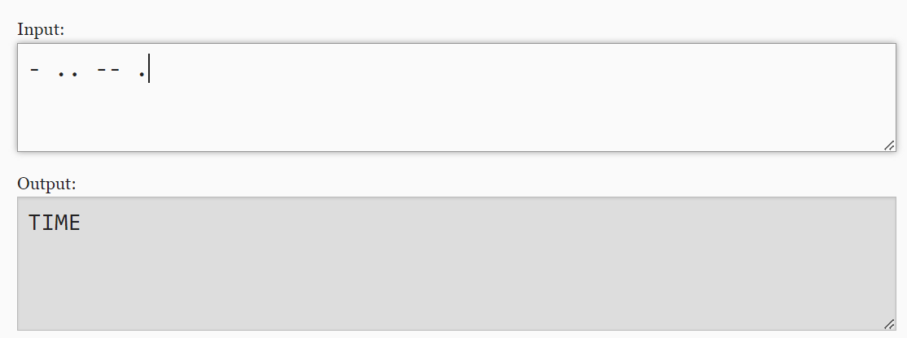

# Is there an echo?

## Category: Forensics
## Challenge Description
- Maybe next time you should record your music in an acoustically treated space.

- The challenge also presented a **WAV audio file** called `256.wav`
- The hint and the file suggested to me that the flag would be hidden in the audio so my primary goal was to learn and find tools to extract or reveal hidden info that was maybe embedded in the audio file.

## Steps Taken

1. **Initial Setup**
   - first thing i did was inspect the audio file using `FFmpeg` so i did:
   `ffmpeg -i 256.wav`

   and it showed me the following:
   - **Duration**: 1 minute and 29 seconds
   - **Sample Rate**: 48,000 Hz
   - **Channel Layout**: Mono

2. **Exploration**
   - since that didn't really tell me a lot of information about the file i decided to first run the file through a **hex editor** to see if there was any textual hints before i would do the more advanced audio extraction techniques
    - when i opened the file in HxD, i scrolled through the data and found a string of readable characters and the end of the file that read
    `cepstral domain single echo`
    
    - the phrase was immediately a clue that i would have to do **cepstral analysis** which i learned was used to detect echoes in a signal
    - i then decided to write code in **Python** because i learned about **MATLAB's `rceps` function** for **real cepstrum**.
    - i used **ScipPy** and **Matplotlib** and attempted to do a real cepstrum analysis on the audio. Here is the core of my code:
    ```
    import numpy as np
    from scipy.io import wavfile
    import matplotlib.pyplot as plt

    # load the WAV file
    sample_rate, audio_data = wavfile.read('256.wav')

    # compute the frequency domain of the audio signal
    spectrum = np.fft.fft(audio_data)

    # compute the logarithm of the magnitude spectrum
    log_spectrum = np.log(np.abs(spectrum))

    # compute the Inverse FFT which is cepstrum
    cepstrum = np.fft.ifft(log_spectrum).real

    plt.plot(cepstrum)
    plt.title('Full Cepstrum of the audio signal')
    plt.xlabel('Quefrency')
    plt.ylabel('Amplitude')
    plt.savefig('full_cepstrum_plot.png')
    ```

    - basically i played around making various graphs and here's what i got:
    
    
    

    - i was trying to compute the **real cepstrum** of the audio signal, because cepstrum basically shows echoes and delays so i tried to visualize the first **1000 quefrencies** to find patters.
    - even though my graphs had different results, they all showed a general **cepstrum plot** that had **large peaks** at **low quefrencies** so that told me there were definitely echoes to be analyzed
    - that was when i realized there is probably software for this..
3. **Analysis**
   - So then i downloaded **Audacity** to further investigate the audio file with the knowledge that i would have to study the **cepstral domain** and a **single echo**.

   - i first inspected the **waveform** and switched also to **spectrogram view** but nothing visually caught my eye as far as spikes or repetitive patterns
   - i then found a way to perform cepstral analysis directly on Audactiy by focusing on **Hann windowing** to isolate the periodic components

   
   - this was the best data i could gather. the cepstrum showed **two strong peaks** around 0.001 seconds, and on my graphs, it correlated to the low quefrency values (**20-50 quefrency**) so i knew i was on the right track

   - the last thing i tried was **bandpass filtering** where i put a bandpass filter around **500 Hz to 1000 Hz** to isolate the mid-range frequencies where the echoes (or maybe speech (?)) resided. i alsso tried using **noise reduction** and **amplification** techniques
   

   - after the filtering and amplifying, i couldn't hear anything but beeps, so my last educated guess was that maybe this was **Morse code**. i carefully listened to the rhythm of the beeps. 
   
   - i somehow ended up obtaining a rhythm that so happened to output an english word **"TIME"**. i really thought this was the flag but it turned out not to be.


## Conclusions
- this challenge was awesome because i learned so much about **audio forensics** and i used **mathematical analysis** and **manual analysis** (using Audactiy).
- i was very happy to discover the hex editor clue **"cepstral domain single echo"** which led me to learn a lot about **cepstrum analysis**
-i also learned a lot of new programming techniques and other useful tools like **FFmpeg**, **HxD Hex Editor**, **Python and Matplotlib**, and **Audactiy**

## Resources
- [Wiki- cepstrum](https://en.wikipedia.org/wiki/Cepstrum)
- [spectrum vs cepstrum](https://physics.stackexchange.com/questions/193086/whats-the-difference-between-frequency-spectral-and-cepstral-domains)
- [rceps function](https://www.mathworks.com/help/signal/ref/rceps.html)
- [morse code](https://morsecode.world/international/translator.html)

