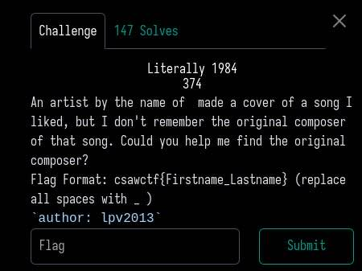
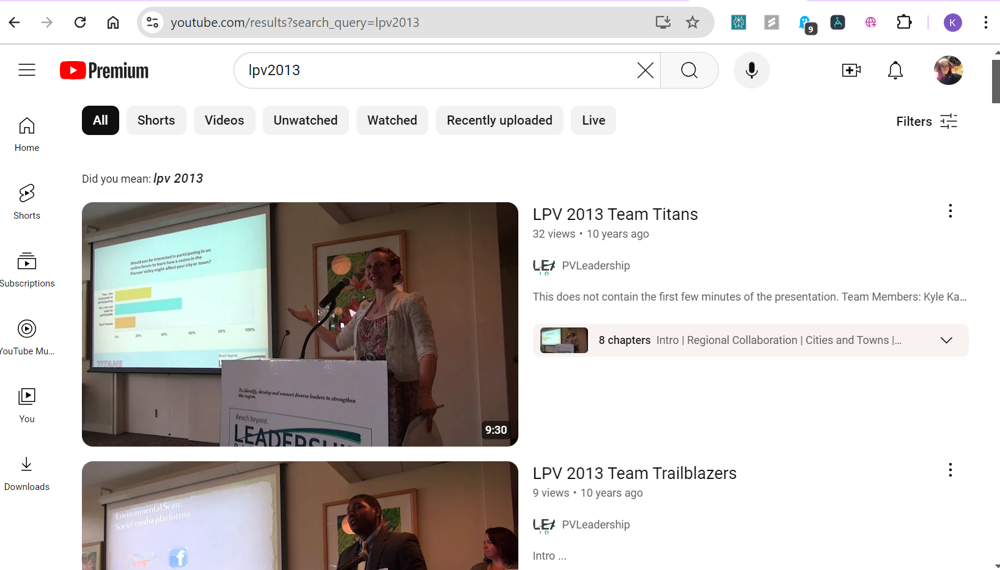
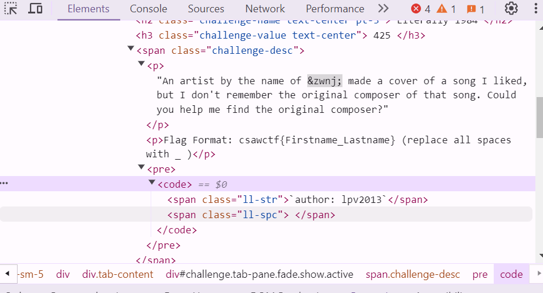
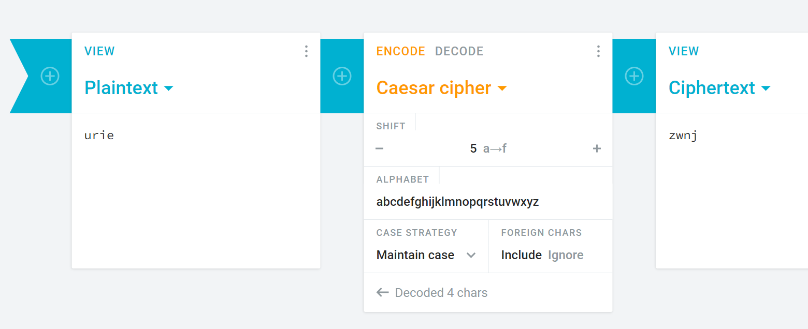

# Literally 1984

## Category: OSINT
## Challenge Description
- An artist by the name of  made a cover of a song I liked, but I don't remember the original composer of that song. Could you help me find the original composer? Flag format: csawctf{Firstname_lastname} (replace all spaces with _ )
`author: lpv2013`

## Steps Taken

1. **Initial Setup**
   - Since this category was OSINT and there weren't any files or other things to look at i decided to investigate the challenge description as much as i could.
   - the title "Literally 1984" seemed to reference either/both the book **1984** by **George Orwell** and/or the year 1984.
   - after doing a bit of pop culture and music history research, it seemed like there was quite a lot of songs from that year, so initially i compiled a list of popular songs from 1984 written by artists like **George Michael**, **Bruce Springsteen**, **Prince** and **Tina Turner**.
   - i went on to research more information about the author because i suspected that `lpv2013` might be the username of the person who created the cover of the song. so i searched for the username on different platforms including Youtube and Soundcloud.
   - The fact that `lpv2013` was wrapped in backticks stood out to me, and that it could be a username, possibly on GitHub too, but this didn't lead to immediate results.
   
2. **Exploration**
   - I decided to examine the HTML source of the page because I noticed in the challenge description there was an extra space between `of` and `made`. I found unusual usage of **invisible characters** like `&zwnj` which means zero-width non-joiner.
   
3. **Analysis**
   - At one point I considered if `zwnj` was encoded using a **Caesar cipher** or another type of simple cipher, shifting letters to reveal the true artist's name. After I tested various shifts, the only one that stood out to me was `urie`, which is the last name of the lead singer of the band **Panic at the Disco**.
   
   - But after more investigation, I couldn't find a potential cover or original song that had to do with **Brandon Urie**, and none of the results i found let to anything meaningful related to 1984.
   - My last attempt was reflecting on the years 1984 and 2013, where 2013 came from the author's username. i realized that the years are about 30 years apart so the song might be a **30th-anniversary cover** of a song from 1984, but again I did not see a clear result.

## Conclusions
- Although I didn't successfully find the exact composer for this CTF challenge, I covered a lot of areas including researching iconic songs and composers from 1984, inspecting invisible characters in the html page source, and considering cryptographic techniques like the **Caesar cipher**. this was fun and original and even though i thought this wouldn't be the most difficult challenge, i quickly realized that OSINT research is a valuable takeaway from this

## Resources
- [lpv2013 Youtube search](https://www.youtube.com/results?search_query=lpv2013)
- ['Literally 1984' song on SoundCloud](https://soundcloud.com/afkara-lp/literally-1984)
- [Caesar cipher](https://cryptii.com/pipes/caesar-cipher)
